# Sharing Profit via Smart Contracts
Implementing a multifaceted profitsharing process on blockchain smartcontracts.

## Outline
Code implements and automates equally weighted profit splits, unequally weighted profit splis, and equity vesting process for a cadre of employees including the leadership.

## Level One: Associate Profit Splitter Contract 
Contract will accept Ether into the contract and divide the Ether evenly among the associate level employees. This will allow the Human Resources department to pay employees quickly and efficiently. Implemented by "AssociateProfitSplitter.sol" contract. 

MetaMask account identification:
HR = Account #1
employee_one = Account #2
employee_two = Account #3
employee_three = Account #4

An example transaction where 3 ETH was distributed by HR *equally* among the employee accounts is shown below. 

Pre transaction balances:

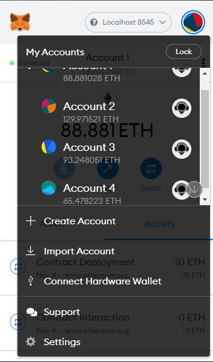

Onset of the profit split deployment:

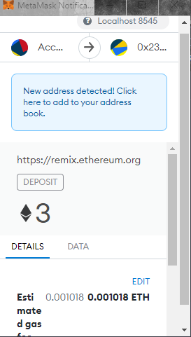

Post transaction balances:

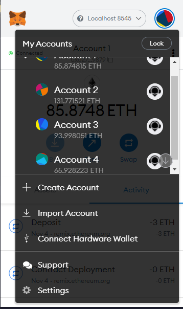

## Level Two: Tiered Profit Splitter Contract
The Contract will distribute different percentages of incoming Ether to employees at different tiers/levels. The CEO gets paid 60%, CTO 25%, and Bob gets 15%. Implemented by "TieredProfitSplitter.sol" contract. 

MetaMask account identification:
HR = Account #1
employee_one = Account #2 (CEO)
employee_two = Account #3 (CTO)
employee_three = Account #4 (BOB)

An example transaction where 10 ETH was distributed by HR in a tierd fashon among the employee accounts is given above (CEO, CTO, and BOB). Since there will be left over ETH that will be transfered to the CEO.

Pre transaction balances:

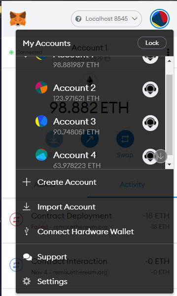

Onset of the profit split deployment:

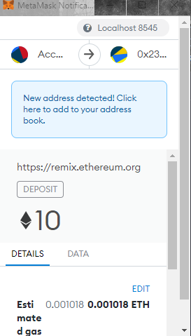

Post transaction balances:

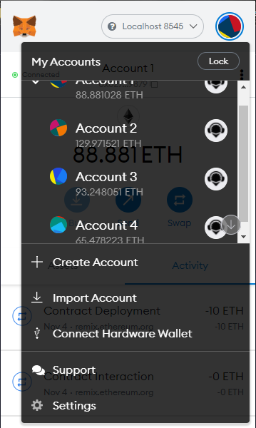

## Level Three: Deferred Equity Plan Contract
The Contract that models traditional company stock plans. This contract will automatically manage 1000 shares with an annual distribution/vesting structure of 250 over 4 years for a single employee. Implemented by "DeferredEquityPlan.sol" contract. 

MetaMask account identification:
HR = Account #1
employee_one = Account #2

An example transaction where 1000 stocks were distributed by HR in a vesting fashion as given above. fastForward function/method was used to observe functionality and then rendered non functional within quotes.

Pre transaction contract deployment on MetaMask:

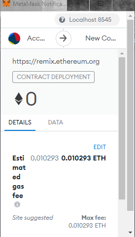

Deployed contract in Remix:

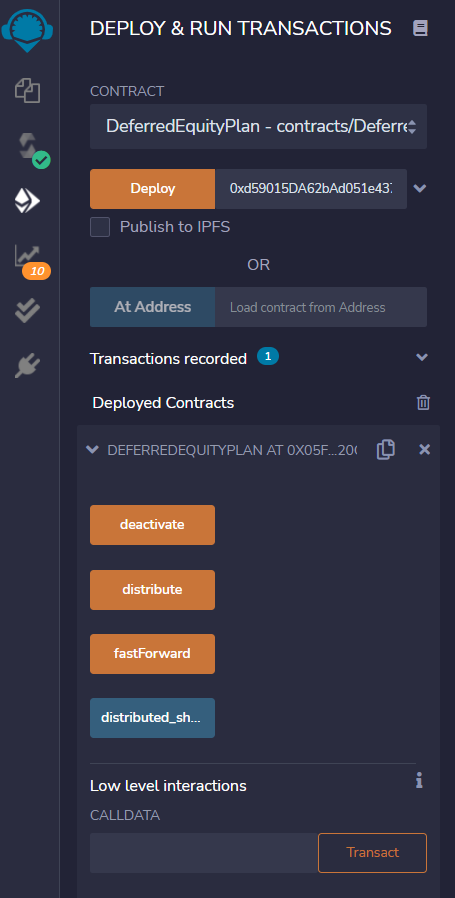

fastForward contract interations on MetaMask:

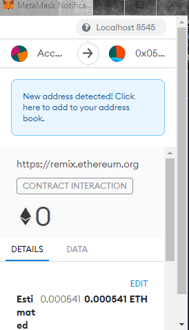

Deployed contract and 250 shares/stocks vested in Remix:

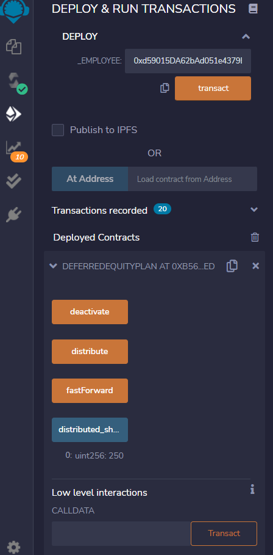

Deployed contract and all 1000 shares/stocks fully vested in Remix:

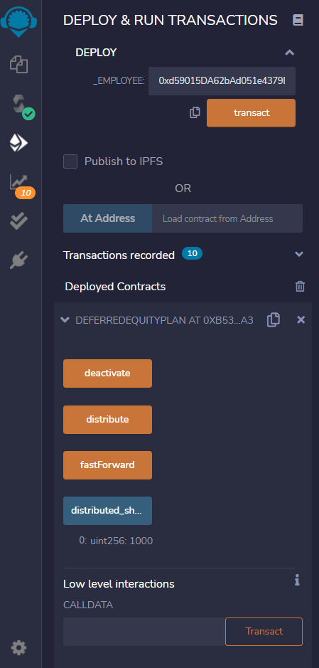

This concludes the three (3) instances of smart cotract deplyment.

### Technologies implemented
Blockchain and smartcontract development via Solidity, Remix IDE, MetaMask, and Ganache (local blockchain).

### Inputs
Pre loaded test ETH in local accounts handled via MetaMask and Ganache. 

### Outputs
Outputs are presented as graphics of the Remix and MetaMask. 

### Remarks
None.
